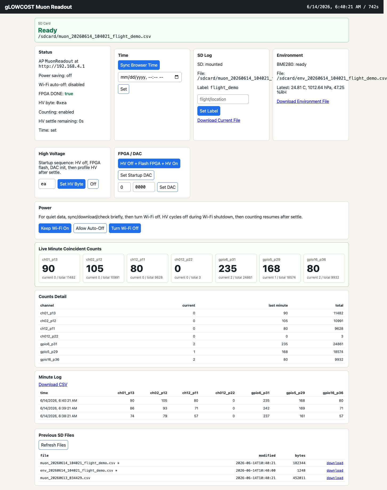

# ESP32-P4 gLOWCOST CubeSat Muon Readout

This repository contains ESP-IDF firmware for running a gLOWCOST/MPPC cosmic-muon detector readout on a Waveshare ESP32-P4 Module DEV KIT. The firmware adapts the Raspberry Pi HAT readout workflow to the ESP32-P4 40-pin header, including FPGA programming, high-voltage control, DAC threshold setup, one-minute count logging, BME280 environment logging, a small Wi-Fi setup interface, and a BLE live display link for an ESP32-S3-GEEK screen.

The active profile is adapted from `tharinduudu/mppcInterface-Oct-2025` for the new layout 3v0 readout.

## Current Hardware Profile

- Controller: Waveshare ESP32-P4 Module DEV KIT, tested on ESP32-P4 rev v1.3.
- Readout board: gLOWCOST/MPPC Raspberry Pi HAT-style detector interface.
- FPGA: iCE40 programmed from embedded `main/fpga.bin`.
- Active FPGA bitstream: `top_50MHz_led100_dt200_pi10us.bin` from the Oct-2025 readout repository.
- High voltage: MAX1932 controlled over SPI, startup byte `0xea`.
- DAC: DACx578 on I2C address `0x47`.
- Startup DAC values: channels 0-3 at `0x2f1`; threshold channels 4-7 at `0x070`.
- Environment sensor: optional BME280 on I2C `0x76` or `0x77`.
- Storage: onboard microSD card in SPI mode.
- Optional quick-look display: Waveshare ESP32-S3-GEEK running `display/s3-geek-ble-display`.

## What The Firmware Does

At boot, the ESP32-P4:

1. Turns HV off.
2. Programs the iCE40 FPGA from `main/fpga.bin`.
3. Starts the FPGA runtime clock.
4. Initializes the DACx578 startup values.
5. Enables HV to `0xea`.
6. Waits 10 seconds before counting, so startup noise is not logged.
7. Mounts the SD card and creates a fresh data file.
8. Starts a Wi-Fi access point and web UI for setup, status, downloads, and controls.
9. Starts BLE live-count advertisements for the S3 screen display.
10. Automatically turns Wi-Fi off after the setup window when no client is connected, while SD logging, counting, and BLE live display continue.

## Quick Start

Flash the ESP32-P4:

```sh
idf.py set-target esp32p4
idf.py build
idf.py -p /dev/cu.usbmodem5B5E1289611 flash monitor
```

Connect to the setup web page:

- SSID: `MuonReadout`
- Password: `glowcost`
- URL: `http://192.168.4.1`

Flash the optional ESP32-S3-GEEK BLE display:

```sh
cd display/s3-geek-ble-display
idf.py set-target esp32s3
idf.py build
idf.py -p /dev/cu.usbmodem11301 flash monitor
```

## Web Interface

The web page highlights SD-card readiness, live one-minute coincident counts, HV/FPGA/DAC controls, environment readings, current log downloads, and previous SD files.



For a field run:

1. Insert the SD card.
2. Power the detector from USB or a power bank.
3. Connect to `MuonReadout`.
4. Open `http://192.168.4.1`.
5. Check that SD card status says ready.
6. Let browser time sync automatically.
7. Add a run label if useful, such as location or flight number.
8. Check live counts briefly on the web page or the S3 BLE display.
9. Use power-saving mode or let Wi-Fi auto-off.
10. Leave the detector running; data continues logging to SD and the S3 display can keep showing live BLE snapshots.

## Guides

- [Detector Operation Guide](docs/operation-guide.md)
- [Detector Sections Explained](docs/detector-sections.md)
- [Build, Flash, And Development Guide](docs/developer-guide.md)
- [Data Files And SD Logging](docs/data-format.md)
- [Threshold Tuning Results](docs/threshold-tuning-results.md)
- [Troubleshooting](docs/troubleshooting.md)

## Repository Layout

```text
CMakeLists.txt
sdkconfig
sdkconfig.defaults
dependencies.lock
main/
  CMakeLists.txt
  idf_component.yml
  app_common.h
  app_state.c
  console.c
  counters.c
  environment.c
  hardware.c
  main.c
  storage.c
  web.c
  fpga.bin
display/
  s3-geek-ble-display/
    CMakeLists.txt
    sdkconfig.defaults
    main/
      CMakeLists.txt
      main.c
docs/
  data-format.md
  detector-sections.md
  developer-guide.md
  kicadSCHEMATIC.pdf
  operation-guide.md
  threshold-tuning-results.md
  troubleshooting.md
```

Generated folders such as `build/` and `managed_components/` are intentionally ignored.

## Safety Notes

This detector controls high voltage. The firmware intentionally turns HV off before FPGA flashing, Wi-Fi shutdown, and startup transitions. Counting is disabled while HV is off or settling.

Do not connect or disconnect scintillator/SiPM hardware while HV is enabled. Power down or turn HV off first.

## Known Good Settings

| Setting | Current value |
| --- | --- |
| FPGA bitstream | `top_50MHz_led100_dt200_pi10us.bin` embedded as `main/fpga.bin` |
| HV byte | `0xea` |
| HV settle delay | 10 seconds |
| DACx578 address | `0x47` |
| SiPM DAC channels 0-3 | `0x2f1` |
| Threshold DAC channels 4-7 | `0x070` |
| Count interval | 60 seconds |
| Environment interval | 5-minute averages |
| Wi-Fi SSID | `MuonReadout` |
| Wi-Fi password | `glowcost` |
| Wi-Fi auto-off | 7 seconds if no client is connected |
| BLE display name | `MuonP4` |

## Current Status

The latest cleaned firmware removes temporary debug diagnostics used during tuning. It keeps SD logging, BME280 environment logging, temperature compensation, web setup, FPGA flashing, HV protection, power-saving behavior, and the BLE live display path.
