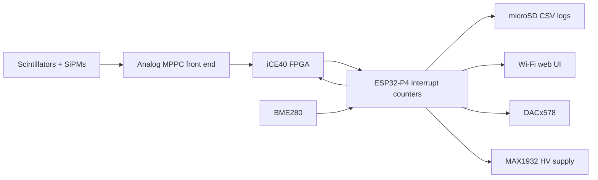
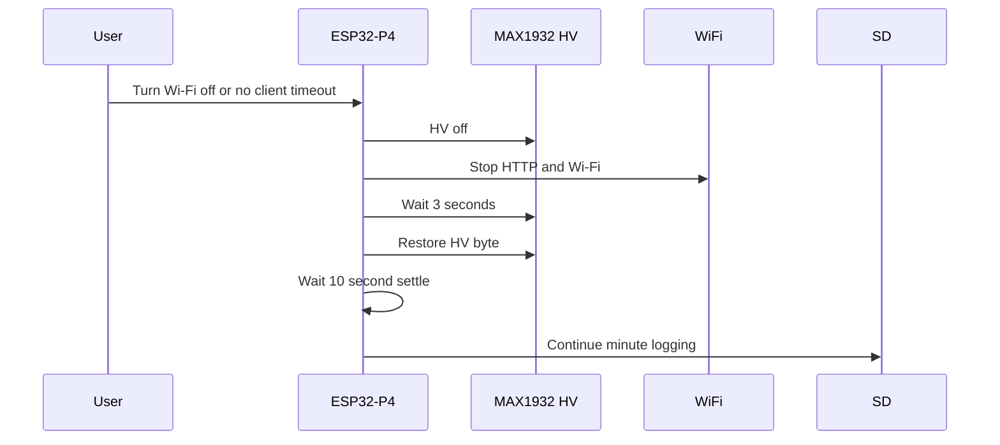

# Detector Sections Explained

This document explains the detector as a set of cooperating hardware and firmware sections.

## System Overview



The original Raspberry Pi software used Linux, WiringPi, SPI, I2C, and shell startup scripts. This firmware moves those responsibilities into ESP-IDF on the ESP32-P4.

## 1. Scintillators And SiPMs

The scintillators convert charged-particle energy deposition into light. SiPM/MPPC sensors convert that light into electrical pulses.

The ESP32-P4 firmware does not directly interpret analog pulse shapes. It receives digital count signals from the readout/FPGA section.

## 2. Analog Front End

The readout board conditions SiPM signals and presents them to the FPGA. The threshold DAC channels affect which pulses are accepted as real detector pulses rather than noise.

Current DAC setup:

| DAC channels | Purpose | Startup code |
| --- | --- | ---: |
| 0-3 | SiPM low-side/bias control | `0x2f1` |
| 4-7 | Threshold control | `0x070` |

Channels 0-3 may be adjusted by temperature compensation. Channels 4-7 stay fixed unless changed manually or by firmware constants.

## 3. High Voltage Section

The MAX1932 high-voltage supply is controlled over SPI. The firmware uses startup byte `0xea`.

Safety behavior:

- HV is off before FPGA programming.
- HV is off during Wi-Fi shutdown.
- Counting is disabled while HV is off.
- Counting is disabled during the 10-second HV settle delay.
- Counters are cleared after settle.

This avoids recording startup transients as detector data.

## 4. FPGA Section

The iCE40 FPGA handles fast detector logic and presents digital outputs to Raspberry-Pi-compatible header pins. The ESP32-P4 programs the FPGA from embedded file:

```text
main/fpga.bin
```

Current bitstream source:

```text
top_50MHz_led100_dt200_pi10us.bin
```

The firmware programs the FPGA over SPI, checks DONE, then starts the runtime clock.

## 5. Counter Section

The ESP32-P4 counts rising edges on seven GPIO interrupt inputs.

| Firmware name | Meaning | Pi physical pin |
| --- | --- | ---: |
| `ch01_p13` | CH0 and CH1 coincidence | 13 |
| `ch02_p12` | CH0 and CH2 coincidence | 12 |
| `ch12_p11` | CH1 and CH2 coincidence | 11 |
| `ch012_p22` | CH0 and CH1 and CH2 coincidence | 22 |
| `gpio6_p31` | raw channel output | 31 |
| `gpio5_p29` | raw channel output | 29 |
| `gpio16_p36` | raw channel output | 36 |

Counting is accumulated into one-minute records.

## 6. SD Logging Section

The SD card is mounted at:

```text
/sdcard
```

Muon data and environment data are written as CSV files. A new file is created at each detector start.

The file list in the web server is sorted newest first, similar to `ls -lt`.

## 7. Environment Section

The BME280 measures:

- temperature
- pressure
- humidity

The firmware logs 5-minute averages in a separate environment CSV file.

If BME280 is detected, temperature compensation uses the same logic as the Oct-2025 `biasAdj.py`:

- fixed reference temperature: 20 C
- slope: 54 mV/C
- channels adjusted: DAC 0-3
- block period: 5 minutes
- minimum step gates to avoid dithering
- threshold DAC channels 4-7 are not temperature-compensated

## 8. Wi-Fi And Web UI Section

The ESP32-P4 starts an access point:

```text
SSID: MuonReadout
Password: glowcost
URL: http://192.168.4.1
```

The web UI is for setup and quick checks. It is not required for counting after setup.

The web server can:

- show SD card status
- show live counts
- sync browser time
- set run labels
- download logs
- control HV
- reflash FPGA safely
- set DAC channels
- enter power-saving mode

## 9. Power-Saving Section

After setup, Wi-Fi is the largest unnecessary load and a possible noise source. The firmware can shut it down while leaving counting and SD logging active.

Power-saving sequence:



## 10. Raspberry Pi To ESP32-P4 Adaptation

The Raspberry Pi project used:

- `rc.local` for startup
- `ice40/main` to flash FPGA
- `max1932/main` to set HV
- `dac.py` for DACx578 writes
- `biasAdj.py` for temperature compensation
- `slowControl/main.cpp` for one-minute counting

The ESP32-P4 firmware implements these roles inside `main/main.c`:

| Raspberry Pi role | ESP32-P4 firmware section |
| --- | --- |
| `rc.local` startup sequence | `app_main()` |
| FPGA flash binary | embedded `main/fpga.bin` and `program_fpga()` |
| MAX1932 HV | `hv_write_and_settle()` |
| `dac.py` | `dacx578_write_channel()` and `dac_set_channel()` |
| `biasAdj.py` | `temp_compensate_dac()` |
| `slowControl/main.cpp` | GPIO ISRs and `counter_task()` |
| tailing logs | web UI, `/api/latest.txt`, SD downloads |
